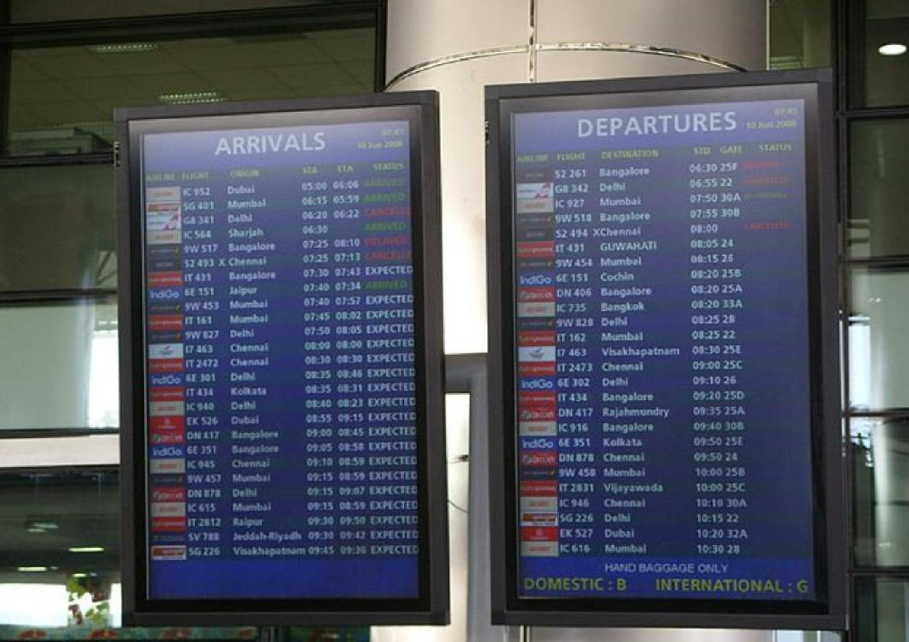
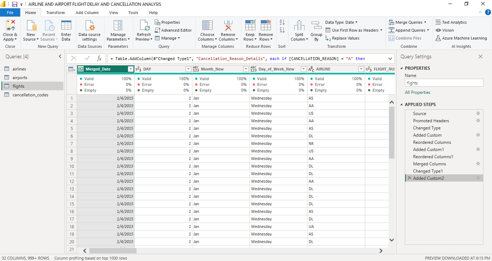

# Airline-And-Airport-Flight-Delay-And-Cancellation-Analysis

## Project Overview
### Introduction:
This is a power BI project on "Airline and Airport Flight Delay and Cancellation Analysis". The information released for this analysis shows records for 5,000,000+ commercial airline flights in 2015, compiled for the U.S. DOT Air Travel Consumer Report. Each record represents a single flight, including the airline name, flight number, origin/destination airport and flight distance, as well as scheduled/actual departure and arrival times

### Problem Statement
- How does the overall flight volume vary by month? By day of week?
- What percentage of flights in experienced a departure delay in 2015? Among 
those flights, what was the average delay time, in minutes?
- How does the % of delayed flights vary throughout the year? What about for 
flights leaving from Boston (BOS) specifically?
- How many flights were cancelled in 2015? What % of cancellations were due to 
weather? What % were due to the Airline/Carrier?
- Which airlines seem to be most and least reliable, in terms of on-time departure?

### Expected Finding:

- Monthly and Weekly Flight Volume Variation: Analysis is anticipated to reveal fluctuations in overall flight volume by month and day of the week. Seasonal trends may emerge, with potentially higher volumes during holiday seasons or peak travel months. Additionally, weekdays may see higher flight volumes compared to weekends due to business travel patterns.

- Departure Delay Percentage and Average Delay Time: It is expected that a certain percentage of flights experienced departure delays in 2015. This percentage may vary across airlines, airports, and months. Furthermore, among delayed flights, the average delay time in minutes is expected to be calculated, providing insight into the severity of delays experienced by passengers.

- Variation of Delayed Flights Percentage: Analysis is expected to uncover fluctuations in the percentage of delayed flights throughout the year. Seasonal weather patterns and increased travel demand during certain months may contribute to variations. Moreover, examining delayed flights specifically from Boston (BOS) may reveal airport-specific trends.

- Flight Cancellations in 2015: The analysis is anticipated to determine the total number of flights cancelled in 2015. Additionally, the percentage of cancellations attributed to weather conditions versus those attributed to the airline or carrier is expected to be assessed. This finding will provide insights into the main reasons for flight cancellations and their impact on passenger travel.

- Airlines' Reliability in On-Time Departure: The study aims to identify airlines that demonstrate high and low reliability in terms of on-time departure. Analysis is expected to reveal variations among airlines, potentially influenced by factors such as operational efficiency, fleet management, and scheduling practices. Identifying the most and least reliable airlines will assist passengers and stakeholders in making informed decisions regarding airline choices.

### About the Dataset
The dataset is made up of 4 tables which are: 
- flights (fact table): This table shows all the flight details such as the airline, departure time, arrival time, etc.
- airlines (dimension table): shows the airline names and their IATA codes.
- airports (dimension table): shows airport details sucu as airport, city, country, etc.
- cancellation code (dimension table): displays the cancellation description and reason.

This dataset was released by [Quantum Analytics](https://www.quantumanalyticsco.org/). The airlines table can be viewed or downloaded [here](airlines.csv),the airports table can also be viewd or downloaded [here](airports.csv), while the cancellation code table can be viewed or downloaded [here](cancellation_codes.csv). The fact table which is the "flights" was too large to be uploaded to github with a size of over 578 MB. Alternatively, you can download the table [here](https://www.dropbox.com/s/uce656ijxu8an66/flights.csv.zip?dl=0).

### Tools Used
1. Power Query Editor
    - Was used to:
        1. Extract,
        2. Transform, and
        3. Load all the datasets for this analysis.
           
2. Power BI (Was used to create reports and dashboard for this analysis)
    - The following Power BI Features were incorporated:
        1. Bookmarking,
        2. DAX,
        3. Quick Measures,
        4. Page Navigation,
        5. Modelling,
        6. Filters,
        7. Tooltips, and
        8. Button

### ETL Process using the Power Query Editor:
1. Transformed the column types in all the tables to the right column types.
2. Added a new column "Mont_New" from the "Month" column in flights table to display the names of the month (January - December) using the "If Statement".
3. Added another column "Day_of_Week_New" from the "Day_of_Week" column in the flights table to display the days of the week (Sunday - Saturday) using the "If Statement".
4. Created a new column "Merged_Date" which comprises of the the "Year", "Month" and "Day_of_Week" columns merged together to have a complete date view.
5. Changed the "Merged_Date" type to "Date".
6. Added another column named "Cancellation_Reason_Details" in the flights table which matches codeS from the "Cancellation_Reason" table with the description in the "Cancellation_Description" cxolumn in the "cancellation code" table to fill the new column.
7. Re-ordered all the columns in the flights table accordingly.
8. You can have a peep of our final query editor screenshot below:

  ### Data Modelling:
- In the model view, i adjusted and re-organized the relationships among the tables to remove and replace the unwanted relationships as seen below:

- In this data model, the relationship is adjusted to remove and replace unwaranted relationships with the required relationships.
- The model is a Star Schema.
- There is 1 fact table which is the "flights" table and 3 dimensions table which are the "airlines", "airports" and the "cancellation code".

## Visuals in Power BI:
The report comprises of 2 pages:

### Report 1

**Analysis:**
From the analysis, we can comfortably give answers to our problem statement and more:
- From the analysis, we have 322 Airports.
- The number of Airlines is 14.
- A total No of 5,819,079 was scheduled for the year 2015
- The number of on-time-flight departures is 3,693,461
- Number of flight delays is 2,125,618
- The number of cancelled flights is 89,884
- The percentage of Airline delays is 36.53%
- The average delay time is 25.27min
- From the dataset, Wednesdays have the most flight traffic with 872,521 flights, Sundays 865,543, while Thurdays follows with 862,209 flights. The least days with traffic happens to be on fridays with 700,545 flights.
- At the top of the 5 most reliable airlines is the Southwest Airlines Co. with an on-time-departure of 695,048, followed by Delta Airlines Inc - 593,418, American Airlines Inc - 480,080, Skywest Airlines Inc - 416,781 and Atlantic Southeast Airlines - 402,080.
- At top of the list of Airlines with the least most reliable airlines judging from the least on-time-departures is Virging America with 36,524 on-time-departures, followed by Frontier Airlines Inc. with 55,943, Hawaiian Airlines Inc. with 56,126, Spirit Airlines Inc. with 65,290, and s Inc. with 128,955.
- Weather conditions happens to be the major reason for flight cancellation with 48,651 flights cancelled and a share of 54.35% of the time, followed by Airline/Carrier reasons with 48,651 cancelled flights and a share of 28.11% and lastly, National Air System issue causing about 25,262 cancelled flights at 17.52%
- July happens to be the month with most flights with 520,718 flights, followed by August with 510,336, and March with 504,312. The month with the least flight happens to be February with 429,191. February being the mosnth with the least flight may be attributed to it being the shortest month in the year, february also often experiences lower flight traffic compared to other months due to being part of the winter season in many regions, february typically lacks major holidays or long weekends, unlike other months such as July and August.  July has the most flight raffic because it is a peak travel month in many regions, coinciding with the summer vacation season. Families, students, and individuals often take advantage of the warm weather and extended break periods to travel for leisure, leading to increased demand for flights, this month also include many holidays and it is a period for summer break when most schoold go on break.
- June has the highest percentage of flight delays with a 42.74%, February - 40.41%, July - 40.26%, December -39.51 and down to the 2 months with the least percentage of flight delays, September at 28.52%, followed by October with 29.85%. September and October often experience more favorable weather conditions compared to other months, especially in regions where inclement weathercontribute to flight delays. The months of June, July, and December also has the highest peercentage of flight delay because these months coincide with peak travel seasons, characterized by increased passenger volumes and higher demand for flights.
- A detailed PDF document containing this information, observations and summary can be viewed [here]
  
### Report 2

- Chicago O'Hare International Airport tops the list of the Airports with most cancelled flight with a figure of 8,548, followed by Dallas/Fort Worth International Airpot with 6,254 and LaGuardia Airport (Marine Air Terminal) with 4,531 cancelled flights.
- 
## View Power BI Dashboard Report
You can interact with report [here](https://app.powerbi.com/view?r=eyJrIjoiNzc2ZTdkMDktYWQxOC00ZDBmLWEwM2QtYTEyYjQ2ZTc2ZmJhIiwidCI6IjdlYzI5NjU5LTNjZjItNGYzZi1hYmIzLWE3MjJlZGY3ZmYyZCJ9).This dashboard report displays clearly an interactive visual of this analysis in power BI.
