# Airline And Airport Flight Delay And Cancellation Analysis
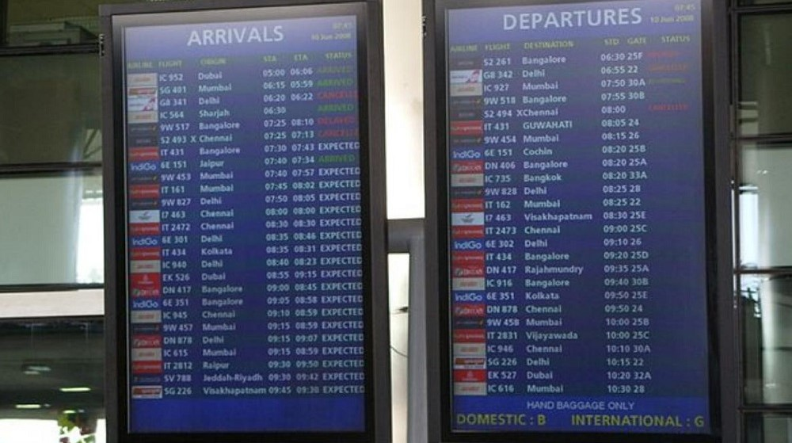
 

## Table of Contents
- [Project Overview](#project-overview)
- [About The Dataset](#about-the-dataset)
- [Tools Used](#tools-used)
- [ETL Process using the Power Query Editor](#etl-process-using-the-power-query-editor)
- [Visuals in Power BI:](#visuals-in-power-bi)
- [Interact With Power BI Dashboard Report](#interact-with-power-bi-dashboard-report)
- [Recommendations Towards Mitigating The Issues of Flight Delays and Cancellations](#recommendations-towards-mitigating-the-issues-of-flight-delays-and-cancellations)
 

## Project Overview
### Introduction:
This is a project on __Airline and Airport Flight Delay and Cancellation Analysis__. The information released for this analysis shows records for 5,000,000+ commercial airline flights in 2015, compiled for the U.S. DOT Air Travel Consumer Report. Each record represents a single flight, including the airline name, flight number, origin/destination airport and flight distance, as well as scheduled/actual departure and arrival times

### Problem Statement:
In 2015, the airline industry faced significant challenges related to flight delays and cancellations, resulting in operational disruptions, financial losses, and passenger inconvenience. Despite advances in technology and operational practices, understanding the root causes and mitigating the impact of these disruptions remains a critical concern for airlines, airports, passengers, and regulatory authorities. This analysis seeks to investigate the frequency, distribution, and underlying factors contributing to flight delays and cancellations within the airline industry during the year 2015, with the objective of identifying actionable recommendations to improve operational efficiency, enhance passenger experience, and ensure the safety and reliability of air travel. The study seeks to address the following research questions:

- How does the overall flight volume vary by month? By day of week?
- What percentage of flights experienced a departure delay in 2015? Among 
those flights, what was the average delay time, in minutes?
- How does the % of delayed flights vary throughout the year? What about for 
flights leaving from Boston (BOS) specifically?
- How many flights were cancelled in 2015? What % of cancellations were due to 
weather? What % were due to the Airline/Carrier?
- Which airlines seem to be most and least reliable, in terms of on-time departure?

### Expected Finding:

- __Monthly and Weekly Flight Volume Variation:__ Analysis is anticipated to reveal fluctuations in overall flight volume by month and day of the week. Seasonal trends may emerge, with potentially higher volumes during holiday seasons or peak travel months. Additionally, weekdays may see higher flight volumes compared to weekends due to business travel patterns.

- __Departure Delay Percentage and Average Delay Time:__ It is expected that a certain percentage of flights experienced departure delays in 2015. This percentage may vary across airlines, airports, and months. Furthermore, among delayed flights, the average delay time in minutes is expected to be calculated, providing insight into the severity of delays experienced by passengers.

- __Variation of Delayed Flights Percentage:__ Analysis is expected to uncover fluctuations in the percentage of delayed flights throughout the year. Seasonal weather patterns and increased travel demand during certain months may contribute to variations. Moreover, examining delayed flights specifically from Boston (BOS) may reveal airport-specific trends.

- __Flight Cancellations in 2015:__ The analysis is anticipated to determine the total number of flights cancelled in 2015. Additionally, the percentage of cancellations attributed to weather conditions versus those attributed to the airline or carrier is expected to be assessed. This finding will provide insights into the main reasons for flight cancellations and their impact on passenger travel.

- __Airlines' Reliability in On-Time Departure:__ The study aims to identify airlines that demonstrate high and low reliability in terms of on-time departure. Analysis is expected to reveal variations among airlines, potentially influenced by factors such as operational efficiency, fleet management, and scheduling practices. Identifying the most and least reliable airlines will assist passengers and stakeholders in making informed decisions regarding airline choices.
 

### About The Dataset
The dataset is made up of 4 tables which are in the .csv file format and they are: 
- __flights (fact table):__ This table shows all the flight details such as the airline, departure time, arrival time, etc.
- __airlines (dimension table):__ shows the airline names and their IATA codes.
- __airports (dimension table):__ shows airport details sucu as airport, city, country, etc.
- __cancellation code (dimension table):__ displays the cancellation description and reason.

This dataset was provided by [Quantum Analytics](https://www.quantumanalyticsco.org/). The airlines data can be viewed or downloaded [here](Data/airlines.csv), the airports data can also be viewd or downloaded [here](Data/airports.csv), while the cancellation code data can be viewed or downloaded [here](Data/cancellation_codes.csv). The fact table which is the "flights" was too large to be uploaded to github with a size of over 578 MB. Alternatively, you can download the data [here](https://www.dropbox.com/s/uce656ijxu8an66/flights.csv.zip?dl=0).
 
 

### Skills Utilized
1. Data Cleaning
2. Data Modelling
3. Data Visualiziation
4. Descriptive Analytics
5. Critical Thinking and Problem Solving
6. Communication and Reporting
 

### Tools Used
1. MS SQL Server
    - Was used to:
        1. Extract,
        2. Cleaning
        3. Transform and,
        4. Load all the datasets for this analysis.
           
2. Power BI (Was used to create reports and dashboard for this analysis)
    - The following Power BI Features were incorporated:
        1. Bookmarking,
        2. DAX,
        3. Quick Measures,
        4. Page Navigation,
        5. Modelling,
        6. Filters,
        7. Tooltips, and
        8. Button
 

### ETL Processes using MS SQL Server:
1. Added a new column __"Month_New"__ from the __"Month"__ column in __flights__ table to display the names of the month (January - December) using the "If function".
2. Added another column __"Day_of_Week_New"__ from the __"Day_of_Week"__ column in the __flights__ table to display the days of the week (Sunday - Saturday) using the "If function".
3. Created a new column __"Merged_Date"__ in the __flight__ table which comprises of the the __"Year"__, __"Month"__ and __"Day_of_Week"__ columns merged together to have a complete date view.
4. Added another column named __"Cancellation_Reason_Details"__ in the __flights__ table which matches codes from the __"Cancellation_Reason"__ table with the description in the __"Cancellation_Description"__ column of the __"cancellation code"__ table to fill the new column.
5. Transformed the column types in all the tables to the right column types.
6. Re-ordered all the columns in the __flights__ table accordingly (done using the Power Query Editor).
7. You can have a view of our final SQL query screenshot below:
 

Sql Query Screenshot                                                                         |                                
:---------------------------------------------------------------------------------:|
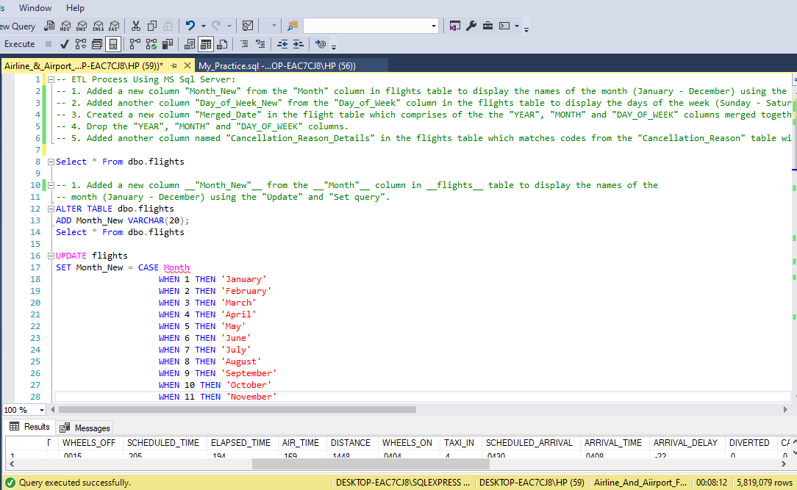   

You can preview the full MS SQL Server query [here](Airline_%26_Airport_Flight_Delay_%26_Cancellation_Project.sql)
 
 

### Data Modelling:
- In the model view, i adjusted and re-organized the relationships among the tables to remove and replace the unwanted relationships as seen below:
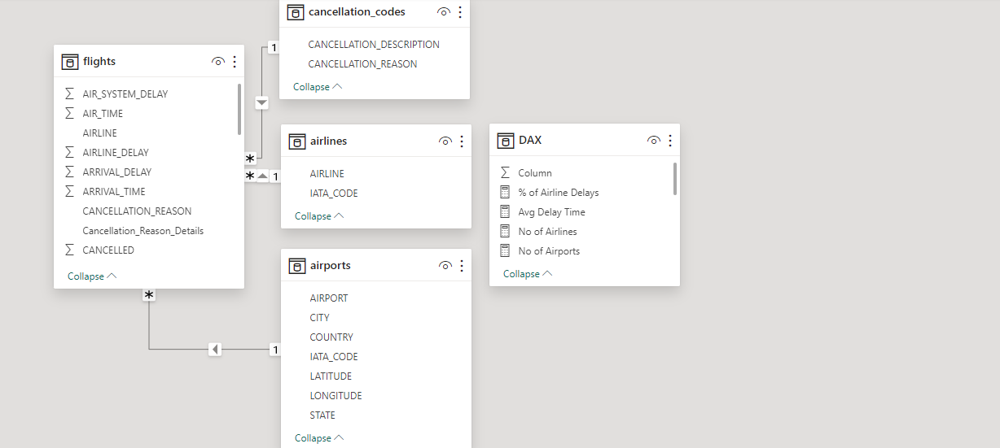

- The model is a Star Schema.
- There is 1 fact table which is the "flights" table and 3 dimensions tables which are the "airlines", "airports" and the "cancellation code".
 
 

## Visuals in Power BI:
The report comprises of 2 pages
 
### Report 1

 
 

#### Analysis:
From the analysis, we can comfortably give answers to our problem statement and more:
- From the analysis, we have __322__ Airports.
- The number of Airlines is __14.__
- A total No of __5,819,079__ flights was scheduled for the year 2015.
- The number of on-time-flight-departures is __3,693,461.__
- Number of flight delays is __2,125,618.__
- The number of cancelled flights is __89,884.__
- The percentage of Airline delays is __36.53%.__
- The average delay time is __25.27__ minutes.
 
 

- 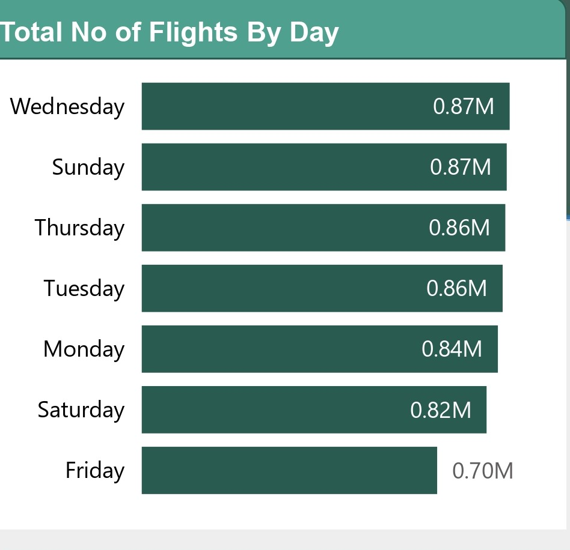

- **Total Number of Flights By Day**
- This means that Wednesday has the highest flights, at 872,521, followed by Sunday at 865,543 and Thursday at 862,209. There is a clear trend in this data showing peak travel during these days of the week. Fridays see the fewest flights, coming in at 700,545, stating that maybe travelers avoid flying at the end of the workweek. Airlines could use these patterns to their benefit in terms of scheduling and resource provisioning with a view to matching demand and efficiency of operations.
 
 

- 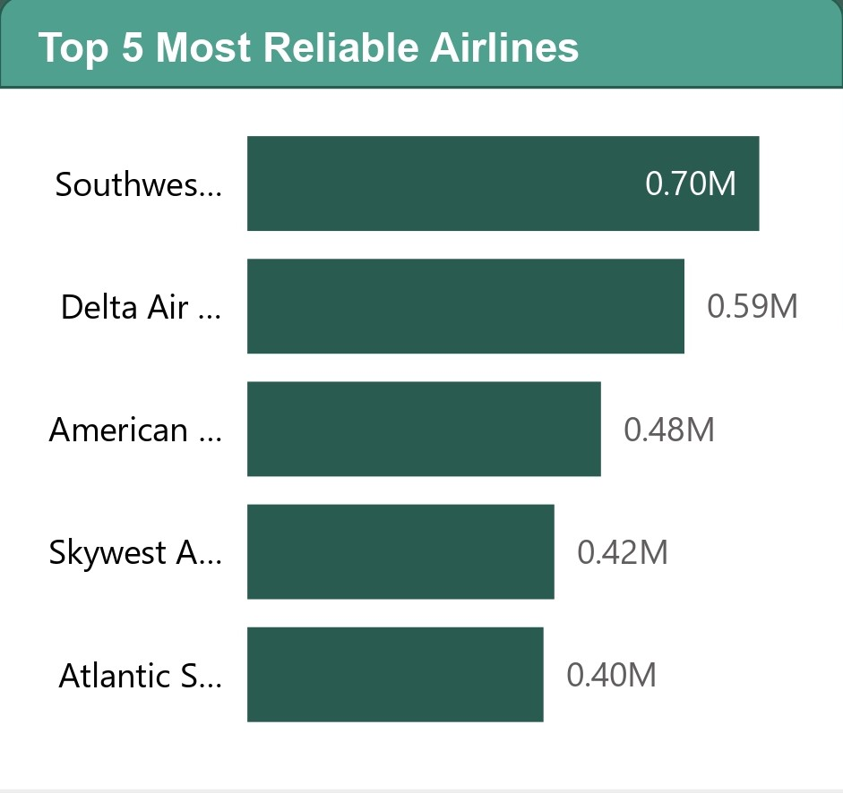

- **Top 5 Most Reliable Airlines**
- Southwest Airlines Co. heads the list of the world's most punctual carriers, having raked up 695,048 on-time departures to its credit, clearly establishing the efficiency and reliability of the carrier. With 593,418 on-time departures, Delta Airlines Inc. showed a very good performance at the second position in volume. American Airlines Inc., Skywest Airlines Inc., and Atlantic Southeast Airlines made up the top five with 480,080, 416,781, and 402,080 on-time departures, respectively. That is evident in the high on-time departure rates of these airlines, which prove that they treat punctuality seriously and really care about satisfying their customers, setting benchmark standard practices for the industry.
 
 

- 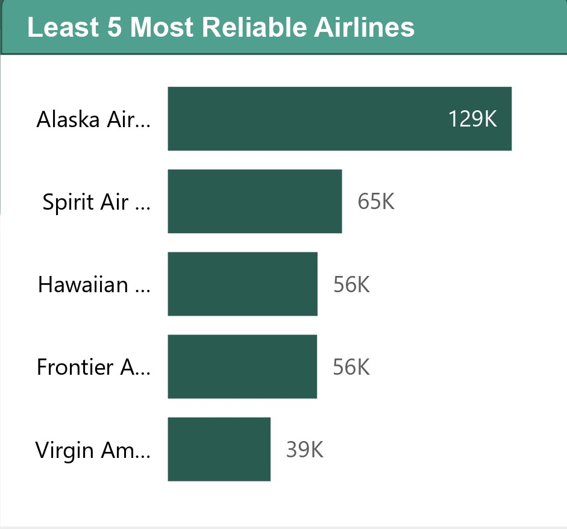

- **Least 5 Most Reliable Airlines**
- Virgin America ranks as the least reliable airline in terms of on-time departures. Only 36524 flights depart on time. Frontier Airlines Inc. follows with 55,943 Hawaiian Airlines Inc. with 56,126 Spirit Airlines Inc. with 65,290 and Alaska Airlines Inc. with 128955. These figures indicate significant room for improvement in punctuality. This impacts customer satisfaction and operational efficiency. Addressing the factors contributing to these delays could enhance their reliability and competitive standing in the industry.
 
 

- 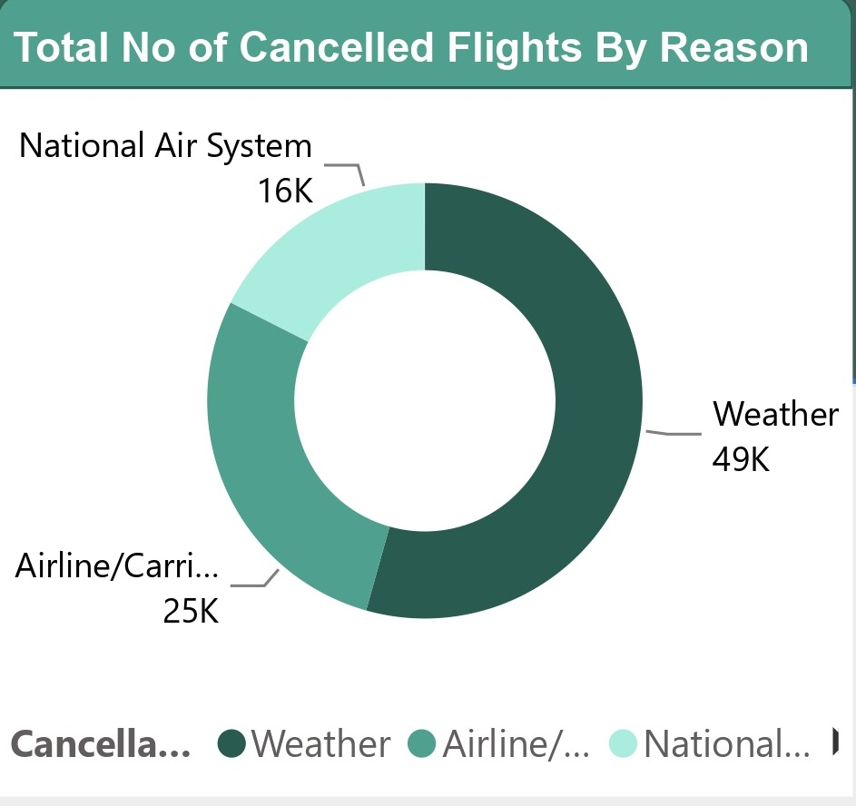

- **Total Number of Cancelled Flights By Reason**
- Weather conditions are the predominant cause of flight cancellations. They account for 54.35% with 48651 flights canceled. This highlights the substantial impact of adverse weather on aviation operations. Airline or carrier-related issues follow with 28.11%. They also resulted in 48,651 cancellations. This indicates significant operational challenges within airlines. 
National Air System issues contribute to 17.52% of cancellations. They affect 25262 flights. This points to systemic inefficiencies in air traffic control and infrastructure. These insights suggest the need for improved weather forecasting. Operational efficiency must also be enhanced Along with better airspace management. All are essential to reducing cancellations and enhance travel reliability
 
 

- 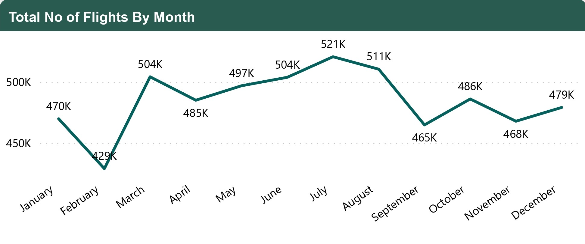

- **Total Number of Flights By Month**
- July happens to be the month with the most flight traffic with 520,718 flights, followed by August with 510,336, and March with 504,312. The month with the least flight traffic happens to be February with 429,191. February being the month with the least flight may be attributed to it being the shortest month in the year, secondly, February often experiences lower flight traffic compared to other months due to being part of the winter season in many regions. February also typically lacks major holidays or long weekends, unlike other months such as July and August. February may experience a dip in business-related travel compared to other months. July has the most flight traffic because it is a peak travel month in many regions, coinciding with the summer vacation season. Families, students, and individuals often take advantage of the warm weather and extended break periods to travel for leisure, leading to increased demand for flights. July include many holidays and it is a period for summer break when most schoold go on break. July is often filled with events, festivals, and cultural celebrations around the world. While July is primarily associated with leisure travel, it also sees significant business and conference-related travel.
 
 

- 

- **Percentage of Flight Delays By Month**
- June has the highest percentage of flight delays with 42.74% February follows with 40.41%. July has 40.26%. December trails at 39.51. Finally, the two months with the lowest percentage of flight delays are September at 28.52% and October at 29.85%. September and October often experience more favorable weather conditions. This is especially true in regions where inclement weather contributes to flight delays. The months of June July and December also have the highest percentage of flight delay because these months coincide with peak travel seasons. These seasons are characterized by increased passenger volumes and higher demand for flights. Some months may experience capacity constraints at airports. Airspace may also become constrained due to high demand for travel and limited available slots for aircraft operations.
 
 
  
### Report 2

 
 

- 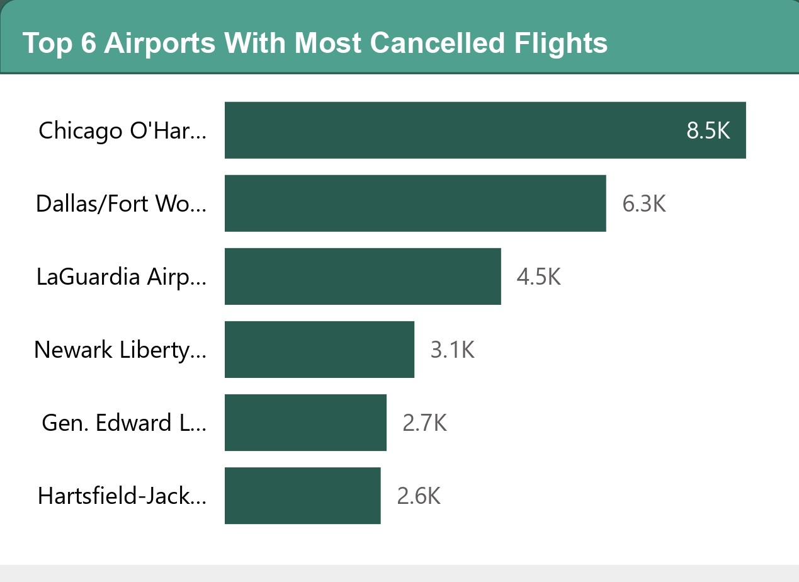

- **Top 6 Airports With Most Cancelled Flights**
- Chicago O'Hare International Airport has the highest number of flight cancellations at 8548. It is followed by Dallas/Fort Worth International Airport with 6,254 cancellations. LaGuardia Airport (Marine Air Terminal) has 4531 cancellations. These airports face high cancellation rates because they are vulnerable to adverse weather conditions. They also experience significant traffic congestion from being among the busiest airports. Various operational and infrastructural challenges further contribute to this issue. Addressing these concerns through improved weather forecasting and enhanced traffic management could reduce the frequency of cancellations. Infrastructure upgrades could also improve overall reliability.
 
 
- 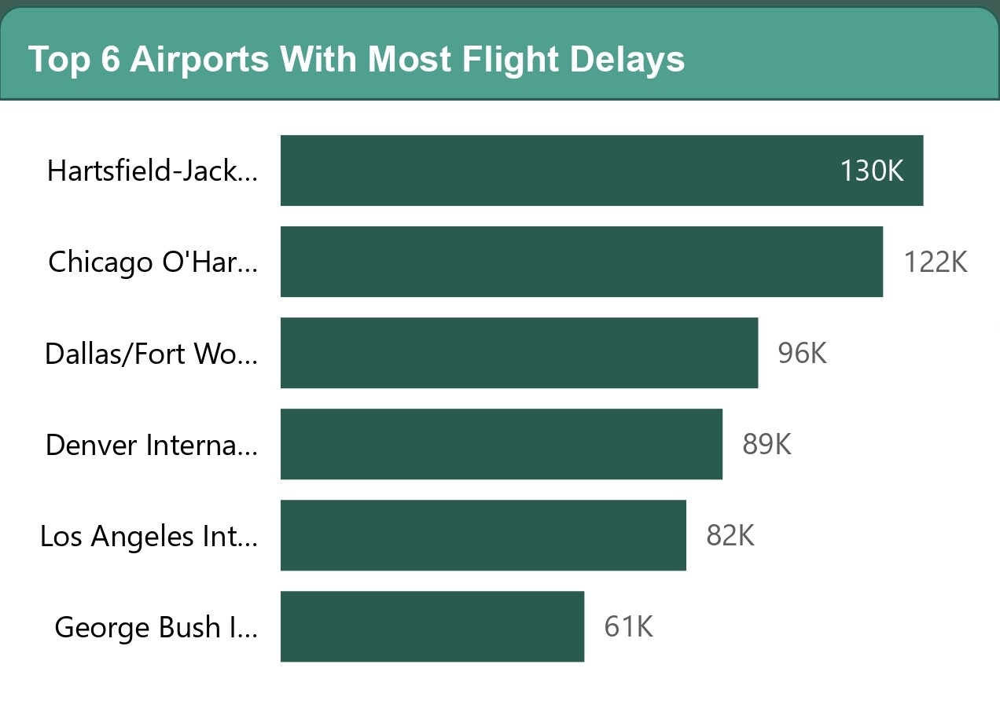

- **Top 6 Airports With Most Flight Delays**
- Hartsfield-Jackson Atlanta International Airport leads the list of airports with the most flight delays, recording 121,706 delays, followed by Chicago O'Hare International Airport with 96,475 delays, Denver International Airport with 89,290 delays, Los Angeles International Airport with 81,954 delays, and George Bush Intercontinental Airport with 61,360 delays. Similar to flight cancellations, these delays are predominantly caused by adverse weather conditions, heavy traffic congestion, airline operational issues, stringent security procedures, and infrastructural constraints. Addressing these challenges through enhanced weather forecasting, better traffic management, operational efficiency improvements, and infrastructure upgrades could significantly reduce the occurrence of flight delays.
 
 

- 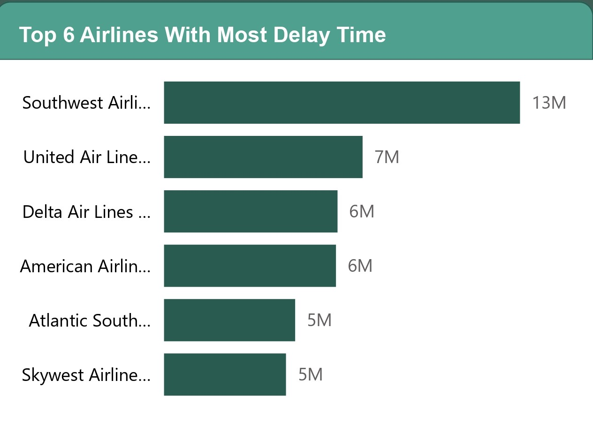

- **Top 6 Airlines With Most Delay Time**
- Southwest Airlines Co. leads the list of airlines with the most flight delay time accumulating a staggering 13,186520 minutes of delays. This is followed by United Airlines Inc. with 7,355348 minutes. Delta Airlines Inc. with 6,427294 minutes. American Airlines Inc. with 6,369435 minutes. Atlanta Southwest Airlines Inc. with 4,857338 minutes and SkyWest Airlines Inc. with 4,517510 minutes. These extensive delay times can be attributed to factors such as operational inefficiencies, fleet reliability issues air traffic control problems, adverse weather conditions, and challenges in crew scheduling and availability. Addressing these issues through strategic operational improvements. Enhanced fleet maintenance. Better air traffic management and optimized crew scheduling can help reduce delay times and improve overall airline punctuality.
 
 

- 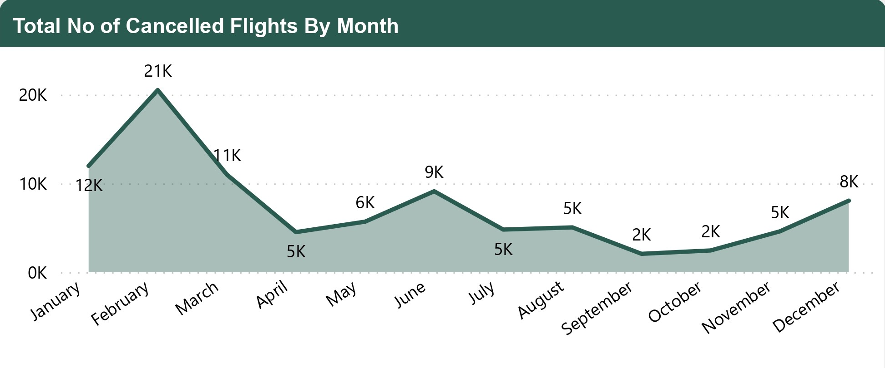

- **Total Number of Cancelled Flights By Month**
- In terms of monthly flight cancellations, February experiences the highest number. The total is 20,517 cancellations. It is followed by January with 11982, March with 11002, June with 9120 and December with 8,003. September has the fewest cancellations. Totaling 2075. Primary reasons for these cancellations include adverse weather conditions, operational challenges increased holiday travel, airport infrastructure constraints, and air traffic control limitations. These insights underscore the need for airlines and airports to enhance their operational resilience. Improve infrastructure and develop robust contingency plans, particularly during peak travel periods and adverse weather conditions.
 
 

- 

- **Percentage of Flight Delays From Boston By Month**
- In examining the percentage of flight delays from Boston by month February leads with a 48.64% delay rate. August follows at 39.89%. July stands at 39.63%. December at 39.06%. March at 37.43%. November has the lowest delay percentage at 28.84%. These variations in delay percentages are influenced by multiple factors including adverse weather conditions, seasonal travel patterns airline operational issues, air traffic control constraints, and airport infrastructure limitations. Understanding these factors can help in implementing targeted strategies to mitigate delays and improve punctuality throughout the year.
 
 

## Interact With Power BI Dashboard Report
You can interact with this report [here](https://app.powerbi.com/view?r=eyJrIjoiNzc2ZTdkMDktYWQxOC00ZDBmLWEwM2QtYTEyYjQ2ZTc2ZmJhIiwidCI6IjdlYzI5NjU5LTNjZjItNGYzZi1hYmIzLWE3MjJlZGY3ZmYyZCJ9).This dashboard report displays clearly an interactive visual of this analysis in power BI.
 
 
 

## Recommendations Towards Mitigating The Issues of Flight Delays and Cancellations:

- __Promoting Collaborative Partnerships:__ Foster collaboration and partnerships among airlines, airports, air traffic control authorities, government agencies, and industry stakeholders to address systemic issues and implement holistic solutions. Establish industry-wide task forces, working groups, and forums to facilitate knowledge sharing, best practice dissemination, and collective problem-solving efforts.
- __Investing in Training and Development:__ Invest in training and development programs for aviation professionals, including pilots, air traffic controllers, maintenance technicians, and ground staff. Emphasize continuous learning, skill development, and crisis management training to enhance operational resilience and decision-making capabilities in handling flight delays and cancellations.

  
- __Improved weather forecasting and preparedness:__ The tracer of cooperation between airlines, airports, and meteorological agencies will raise the level of weather forecasting accuracy and early warning systems. Implement proactive measures like de-icing procedures, snow removal equipment, and contingency plans that help reduce the impact of adverse weather conditions on flight operations.
- __Airport Infrastructure Upgrade:__ Upgrade and augment airport infrastructure to enhance capacity efficiency and resilience to weather-related disruptions. Achieved through the upgrading of the runway, expansion of taxiways, and renovation of terminals. These are upgrades that will reduce congestion and hence provide for smoother aircraft movements during peak periods.
- __Improved Traffic Handling of Airspace:__ Air traffic management systems are to be upgraded in order to fully exploit the potentials of airspace. Thereby, congestion would be reduced and more effective air traffic flow would result. Next Generation Systems, satellite-based navigation, and collaborative decision-making tools partially comprise such technologies that will guarantee increased safety and efficiency within NAS.
- __Set up and Implement Operational Best Practices for the Airline Industry:__ Using a best-practice operational framework, which shall include—among other initiatives—the optimization of fleet management and crew scheduling. Of importance will be contingency planning in terms of maintenance. With major emphasis on proactive maintenance programs, efficient turnaround processes are a must. Have a robust mechanism for communication. Minimize disruptions. Maximize on-time performance.
- __Improve the structure of customer communication and support;__ Intimate customers about delays and cancellations. Help passengers with other travel arrangements if needed. Ensure that belligerent passenger help programs are implemented. Flexibility in rebooking policy. Proactive notification systems to minimize inconvenience. Update Travelers on time.
- __Regulatory Oversight Strenghtening:__ Tighten oversight over the enforcing mechanisms of regulatory policies for enforcement of set safety standards, following operational guidelines in passengers' rights regulations. This is through collaboration with the industry stakeholders to offer developmental reforms in regulation and update regulatory reforms. Improve transparency for accountability and dependability in flight operations.
- __Promotion of collaborative partnerships:__ Rich collaboration and partnership between airlines, airports, air traffic control authorities, government agencies, and industry stakeholders. Holistic solutions treat systemic issues. Industry-wide task forces created. Working groups established for knowledge sharing and dissemination of best practices, further supporting collective problem-solving efforts.
- __Training and Development Investment:__ Develop relevant training and development programs for all aviation professionals, from pilots and air traffic controllers as essential front liners to maintenance technicians and ground staff. Such designs should emphasize continuous learning with a focus on skill development. This crisis management training may improve the resilience of the operation. Improve decision-making capability in handling delays and cancellations of flights.
 
 

## Thank You For Following Through!

